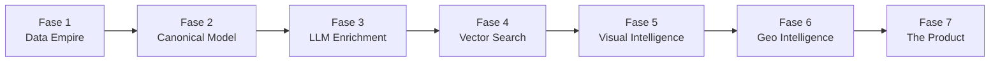

# CamperBot → GeoSemantic Engine
## Master Plan — Mayo 2026

---

## La Visión

No estamos construyendo "otra app de spots camper".  
Estamos construyendo un **motor geoespacial semántico** que:

1. **Absorbe** datos de 10+ fuentes de POIs camper en Europa
2. **Fusiona** duplicados geográficos en spots canónicos
3. **Enriquece** cada spot con análisis LLM de miles de reviews
4. **Vectoriza** el conocimiento para búsqueda por lenguaje natural
5. **Analiza** fotos y terreno para inferir atributos invisibles
6. **Responde** preguntas complejas como un copiloto humano experto

```
"sitios tranquilos con sombra cerca del mar donde no venga la policía"
```

Eso NO es SQL. Eso es búsqueda vectorial + geográfica + semántica.

---

## Estado Actual (Fase 0 completada)

| Métrica | Valor |
|---|---|
| Lugares activos | ~125.000 |
| Fuentes integradas | 5 (P4N, OSM, AreasAC, Furgovw, iOverlander) |
| Fuentes en progreso | 1 (CamperContact) |
| Multi-fuente | ~3.500 |
| Reviews | ~500.000 |
| Infra | NAS Synology + Docker + PostgreSQL/PostGIS |
| Frontend | PWA MapLibre con chat Gemini |
| Backend | FastAPI + asyncpg |

---

## Roadmap de Fases



| Fase | Nombre | Objetivo | Complejidad | Impacto |
|---|---|---|---|---|
| **1** | Data Empire | 10+ fuentes, 500K+ spots | ★★★☆☆ | ★★★★★ |
| **2** | Canonical Model | DB rediseñada, dedup avanzada | ★★★★☆ | ★★★★★ |
| **3** | LLM Enrichment | Scores semánticos pre-computados | ★★★★★ | ★★★★★ |
| **4** | Vector Search | pgvector + búsqueda natural | ★★★☆☆ | ★★★★☆ |
| **5** | Visual Intelligence | CLIP embeddings + metadata visual | ★★★★☆ | ★★★☆☆ |
| **6** | Geo Intelligence | DEM, sun exposure, stealth scoring | ★★★★★ | ★★★★☆ |
| **7** | The Product | PWA 2.0, offline, voz, monetización | ★★★☆☆ | ★★★★★ |

---

## Principios de Arquitectura

### 1. Raw data es sagrada
Nunca modificar datos crudos. Almacenar siempre el JSON original de cada fuente.

### 2. Separar capas
```
CAPA 1: Raw Sources (inmutable)
CAPA 2: Canonical Spots (fusionado)
CAPA 3: Semantic Enrichment (LLM)
CAPA 4: Vector Embeddings (búsqueda)
CAPA 5: Visual/Geo Intelligence (análisis)
```

### 3. Precomputar, no improvisar
El LLM NO piensa en tiempo real. Todo se pre-procesa. El usuario solo consulta conocimiento estructurado.

### 4. Incremental, no batch
Nunca re-scrapear todo. Solo actualizar cambios (`last_seen`, checksums, diffs).

### 5. El valor está en la fusión
Un spot con datos de 5 fuentes + 200 reviews procesados por LLM + scoring visual = imbatible.

---

## Stack Técnico Target

| Capa | Tecnología |
|---|---|
| DB | PostgreSQL 16 + PostGIS + pgvector |
| Backend | FastAPI + Python 3.12 |
| Scraping | httpx + Playwright + mitmproxy |
| Colas | Redis + Celery (o APScheduler actual) |
| LLM enrich | Gemini Flash (barato) / Llama local |
| Embeddings | sentence-transformers / OpenAI ada-002 |
| Visual | CLIP / SigLIP / DINOv2 |
| GIS | GDAL + rasterio + geopandas |
| Frontend | PWA + MapLibre GL + Service Workers |
| Infra | NAS Docker → escalar a Hetzner si necesario |

---

## Documentos de Fase

- [fase-1-data-empire.md](file:///C:/Users/ledec/.gemini/antigravity/brain/5391b3a8-a987-4b97-bae9-c4f2a5dc278c/fase-1-data-empire.md) — Adquisición masiva
- [fase-2-canonical-model.md](file:///C:/Users/ledec/.gemini/antigravity/brain/5391b3a8-a987-4b97-bae9-c4f2a5dc278c/fase-2-canonical-model.md) — Modelo canónico + dedup
- [fase-3-llm-enrichment.md](file:///C:/Users/ledec/.gemini/antigravity/brain/5391b3a8-a987-4b97-bae9-c4f2a5dc278c/fase-3-llm-enrichment.md) — Enriquecimiento semántico
- [fase-4-vector-search.md](file:///C:/Users/ledec/.gemini/antigravity/brain/5391b3a8-a987-4b97-bae9-c4f2a5dc278c/fase-4-vector-search.md) — Búsqueda vectorial
- [fase-5-visual-intelligence.md](file:///C:/Users/ledec/.gemini/antigravity/brain/5391b3a8-a987-4b97-bae9-c4f2a5dc278c/fase-5-visual-intelligence.md) — Inteligencia visual
- [fase-6-geo-intelligence.md](file:///C:/Users/ledec/.gemini/antigravity/brain/5391b3a8-a987-4b97-bae9-c4f2a5dc278c/fase-6-geo-intelligence.md) — Inteligencia geoespacial
- [fase-7-product.md](file:///C:/Users/ledec/.gemini/antigravity/brain/5391b3a8-a987-4b97-bae9-c4f2a5dc278c/fase-7-product.md) — El producto final
