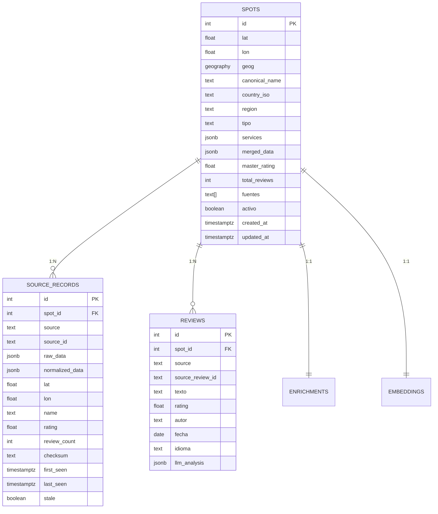

# Fase 2 — Canonical Model
## Spot único, source records, deduplicación avanzada

---

## Problema

Ahora mismo tenemos UNA tabla `lugares` donde:
- Un mismo parking aparece como 3 filas distintas si 3 fuentes lo tienen y no matchean por proximidad
- Los datos "display" se sobreescriben por orden de llegada
- No hay forma de saber "qué dijo P4N vs qué dijo CamperContact"
- El `datos_por_fuente` JSONB de Fase 0.5 es un parche temporal

Con 500K spots de 10+ fuentes, esto **colapsa**.

---

## Solución: Modelo de 3 Tablas



---

## Diferencias clave vs modelo actual

| Aspecto | Modelo actual (`lugares`) | Modelo nuevo (`spots` + `source_records`) |
|---|---|---|
| Raw data | Perdido (sobreescrito) | Preservado eternamente en `source_records.raw_data` |
| Conflictos | COALESCE ciego | Reconciliación por credibilidad desde `normalized_data` |
| Dedup | Solo proximidad 50-100m | Geohash + distancia + similitud nombre + tipo |
| Actualización | Re-scrapear todo | Incremental con `checksum` + `last_seen` |
| Reviews | Tabla plana | Con `llm_analysis` pre-computado |
| Fuentes | Array `text[]` en la fila | Tabla dedicada con historial completo |

---

## DDL Propuesto

```sql
-- ══════════════════════════════════════════
-- SPOTS: entidad canónica (1 por lugar físico)
-- ══════════════════════════════════════════
CREATE TABLE spots (
    id              SERIAL PRIMARY KEY,
    lat             DOUBLE PRECISION NOT NULL,
    lon             DOUBLE PRECISION NOT NULL,
    geog            GEOGRAPHY(Point, 4326) GENERATED ALWAYS AS
                    (ST_SetSRID(ST_MakePoint(lon, lat), 4326)::geography) STORED,
    canonical_name  TEXT NOT NULL,
    country_iso     TEXT,
    region          TEXT,
    tipo            TEXT DEFAULT 'otro',

    -- Servicios reconciliados (resultado de reconciliar.py)
    gratuito        BOOLEAN,
    precio_info     TEXT,
    agua_potable    BOOLEAN,
    vaciado_negras  BOOLEAN,
    vaciado_grises  BOOLEAN,
    electricidad    BOOLEAN,
    ducha           BOOLEAN,
    wifi            BOOLEAN,
    wc_publico      BOOLEAN,
    perros          BOOLEAN,
    acceso_grandes  BOOLEAN,
    num_plazas      INT,
    altura_max_m    REAL,

    -- Metadata agregada
    master_rating   REAL,
    total_reviews   INT DEFAULT 0,
    fuentes         TEXT[] DEFAULT '{}',
    num_fuentes     INT GENERATED ALWAYS AS (array_length(fuentes, 1)) STORED,

    -- Descripciones reconciliadas
    descripcion_es  TEXT,
    descripcion_en  TEXT,
    descripcion_fr  TEXT,
    descripcion_de  TEXT,

    -- URLs
    web             TEXT,
    telefono        TEXT,
    fotos_urls      JSONB DEFAULT '[]',

    -- Control
    activo          BOOLEAN DEFAULT TRUE,
    verificado      BOOLEAN DEFAULT FALSE,
    advertencia     TEXT,
    conflictos      JSONB DEFAULT '[]',
    created_at      TIMESTAMPTZ DEFAULT NOW(),
    updated_at      TIMESTAMPTZ DEFAULT NOW()
);

CREATE INDEX idx_spots_geog ON spots USING GIST(geog);
CREATE INDEX idx_spots_tipo ON spots(tipo);
CREATE INDEX idx_spots_fuentes ON spots USING GIN(fuentes);
CREATE INDEX idx_spots_activo ON spots(activo) WHERE activo = TRUE;

-- ══════════════════════════════════════════
-- SOURCE_RECORDS: datos crudos por fuente
-- ══════════════════════════════════════════
CREATE TABLE source_records (
    id              SERIAL PRIMARY KEY,
    spot_id         INT REFERENCES spots(id) ON DELETE CASCADE,
    source          TEXT NOT NULL,
    source_id       TEXT NOT NULL,

    -- Raw original (inmutable)
    raw_data        JSONB NOT NULL,

    -- Normalizado al esquema común
    normalized_data JSONB NOT NULL,

    -- Campos clave duplicados para queries rápidas
    lat             DOUBLE PRECISION,
    lon             DOUBLE PRECISION,
    name            TEXT,
    rating          REAL,
    review_count    INT,

    -- Control incremental
    checksum        TEXT,
    first_seen      TIMESTAMPTZ DEFAULT NOW(),
    last_seen       TIMESTAMPTZ DEFAULT NOW(),
    stale           BOOLEAN DEFAULT FALSE,

    UNIQUE(source, source_id)
);

CREATE INDEX idx_sr_spot ON source_records(spot_id);
CREATE INDEX idx_sr_source ON source_records(source);
CREATE INDEX idx_sr_stale ON source_records(stale) WHERE stale = TRUE;
```

---

## Algoritmo de Deduplicación (3 capas)

### Capa 1: Geohash rápido

```python
import geohash2

# Precision 7 ≈ 150m × 150m
gh = geohash2.encode(lat, lon, precision=7)
# Buscar en DB: SELECT * FROM spots WHERE geohash7 = $1
```

Pre-filtro O(1) que reduce candidatos de 500K a ~10.

### Capa 2: Distancia geodésica

```sql
SELECT id, canonical_name, tipo,
       ST_Distance(geog, ST_SetSRID(ST_MakePoint($2, $1), 4326)::geography) AS dist_m
FROM spots
WHERE ST_DWithin(geog, ST_SetSRID(ST_MakePoint($2, $1), 4326)::geography, 150)
ORDER BY dist_m
LIMIT 5
```

Radio de 150m para capturar todos los candidatos reales.

### Capa 3: Similitud semántica

```python
from difflib import SequenceMatcher

def nombre_similar(a: str, b: str) -> float:
    """Score 0-1 de similitud entre nombres."""
    a = a.lower().strip()
    b = b.lower().strip()
    # Eliminar prefijos comunes (Aire de, Area de, Parking de...)
    for prefix in ["aire de ", "area de ", "parking ", "camping ", "stellplatz "]:
        a = a.removeprefix(prefix)
        b = b.removeprefix(prefix)
    return SequenceMatcher(None, a, b).ratio()
```

### Decisión final

```python
def es_duplicado(spot_existente, spot_nuevo) -> bool:
    dist = calcular_distancia(spot_existente, spot_nuevo)
    sim = nombre_similar(spot_existente.name, spot_nuevo.name)

    # Mismo lugar seguro
    if dist < 30 and sim > 0.6:
        return True

    # Probable mismo lugar
    if dist < 80 and sim > 0.4:
        return True

    # Mismo nombre exacto, algo lejos
    if dist < 150 and sim > 0.85:
        return True

    # Mismo tipo + muy cerca (sin importar nombre)
    if dist < 25 and spot_existente.tipo == spot_nuevo.tipo:
        return True

    return False
```

---

## Migración desde Esquema Actual

### Script de migración `migrate_to_canonical.py`

```python
async def migrate(pool):
    """
    1. Crear tablas nuevas (spots, source_records)
    2. Para cada lugar en 'lugares':
       a. Crear spot canónico
       b. Crear source_record por cada fuente en datos_por_fuente
       c. Migrar reviews vinculando al spot_id nuevo
    3. Mantener tabla 'lugares' como backup
    """
```

> [!WARNING]
> La migración NO borra la tabla `lugares`. Se renombra a `lugares_legacy` y queda como backup hasta verificar que todo funciona.

---

## Reconciliación en el Nuevo Modelo

Con `source_records`, la reconciliación es limpia:

```python
async def reconciliar_spot(conn, spot_id):
    records = await conn.fetch(
        "SELECT source, normalized_data FROM source_records WHERE spot_id = $1",
        spot_id
    )

    # Construir datos_por_fuente desde source_records
    dpf = {r["source"]: r["normalized_data"] for r in records}

    # Aplicar jerarquía de credibilidad (de reconciliar.py)
    updates, conflictos = reconciliar_lugar(dpf)

    # Actualizar spot canónico
    await update_spot(conn, spot_id, updates, conflictos)
```

---

## Métricas de Éxito

| Métrica | Objetivo |
|---|---|
| Spots canónicos únicos | ~350K (de 500K source_records) |
| Tasa de dedup correcta | > 95% |
| Raw data preservado | 100% |
| Source records por spot | promedio ≥ 1.4 |
| Tiempo de reconciliación batch | < 10 minutos para 350K spots |
