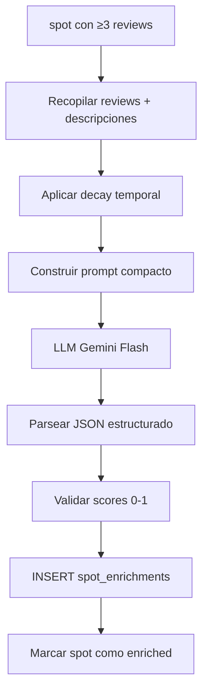

# Fase 3 — LLM Enrichment
## Enriquecimiento semántico pre-computado

---

## La Idea Central

Un spot con 40 reviews de 4 fuentes tiene un TESORO de información implícita que ningún campo booleano captura:

- "muy tranquilo de noche" → `quietness: 0.9`
- "vino la policía a las 3am" → `police_risk: 0.8`
- "mucho viento siempre" → `wind_exposure: 0.85`
- "sombra perfecta por la mañana" → `shade_morning: true`
- "ruido de autopista constante" → `road_noise: 0.7`
- "ideal para furgos pequeñas, difícil con autocaravana grande" → `large_vehicle_access: 0.2`
- "vistas increíbles al mar" → `beauty: 0.95, sea_view: true`
- "reformaron los baños en 2024" → `facilities_updated: 2024`

**El LLM NO responde al usuario en tiempo real.**  
**El LLM PRE-PROCESA offline y genera scores estructurados.**

Luego el chat solo consulta datos ya computados → rápido y barato.

---

## Tabla `spot_enrichments`

```sql
CREATE TABLE spot_enrichments (
    spot_id         INT PRIMARY KEY REFERENCES spots(id) ON DELETE CASCADE,

    -- ═══ SCORES SEMÁNTICOS (0.0 - 1.0) ═══
    quietness       REAL,    -- Tranquilidad
    safety          REAL,    -- Seguridad percibida
    police_risk     REAL,    -- Riesgo de policía/multa
    beauty          REAL,    -- Belleza del entorno
    stealth         REAL,    -- Viabilidad para pernocta discreta
    road_noise      REAL,    -- Ruido de carretera
    wind_exposure   REAL,    -- Exposición al viento
    crowd_level     REAL,    -- Nivel de masificación
    cleanliness     REAL,    -- Limpieza del lugar

    -- ═══ ATRIBUTOS INFERIDOS ═══
    shade_morning   BOOLEAN, -- Sombra por la mañana
    shade_afternoon BOOLEAN, -- Sombra por la tarde
    sea_view        BOOLEAN, -- Vistas al mar
    mountain_view   BOOLEAN, -- Vistas a montaña
    lake_nearby     BOOLEAN, -- Lago/río cerca
    beach_nearby    BOOLEAN, -- Playa cerca
    forest_nearby   BOOLEAN, -- Bosque cerca
    urban_area      BOOLEAN, -- Zona urbana

    -- ═══ ACCESO Y RESTRICCIONES ═══
    large_vehicle   REAL,    -- Accesibilidad para >7m (0=imposible, 1=perfecto)
    road_quality    REAL,    -- Calidad del acceso (0=pista, 1=asfalto perfecto)
    overnight_safe  BOOLEAN, -- ¿Se puede dormir sin problemas?

    -- ═══ TEMPORALIDAD ═══
    best_season     TEXT,    -- "verano", "primavera-otoño", "todo el año"
    avoid_season    TEXT,    -- "agosto" (masificado), "invierno" (cerrado)

    -- ═══ TAGS SEMÁNTICOS ═══
    tags            TEXT[],  -- ["surf", "senderismo", "playa", "tranquilo", "familias"]
    best_for        TEXT[],  -- ["parejas", "overlanding", "fotografía", "perros"]

    -- ═══ RESUMEN LLM ═══
    llm_summary_es  TEXT,    -- Resumen de 2-3 frases en español
    llm_summary_en  TEXT,    -- Resumen en inglés

    -- ═══ METADATA DEL PROCESO ═══
    reviews_analyzed INT,     -- Cuántas reviews se procesaron
    confidence      REAL,     -- Confianza general (más reviews = más confianza)
    model_used      TEXT,     -- "gemini-2.0-flash", "llama-3"
    processed_at    TIMESTAMPTZ DEFAULT NOW(),
    stale           BOOLEAN DEFAULT FALSE  -- Marcar para re-procesar
);
```

---

## Pipeline de Enriquecimiento



---

## Prompt Template

```
Eres un analista experto en spots para autocaravanas y furgonetas camper.

Analiza las siguientes reviews y descripciones de un spot y genera un JSON
con scores numéricos (0.0-1.0) y atributos booleanos.

SPOT: "{nombre}" ({tipo}) en {pais}
Coordenadas: {lat}, {lon}

DESCRIPCIONES:
{descripcion_es}
{descripcion_en}
{descripcion_fr}

REVIEWS (ordenadas por fecha, las más recientes primero):
{reviews_formateadas}

Genera EXACTAMENTE este JSON (sin markdown, sin explicación):
{
  "quietness": <0-1>,
  "safety": <0-1>,
  "police_risk": <0-1>,
  "beauty": <0-1>,
  "stealth": <0-1>,
  "road_noise": <0-1>,
  "wind_exposure": <0-1>,
  "crowd_level": <0-1>,
  "cleanliness": <0-1>,
  "shade_morning": <bool>,
  "shade_afternoon": <bool>,
  "sea_view": <bool>,
  "mountain_view": <bool>,
  "lake_nearby": <bool>,
  "beach_nearby": <bool>,
  "forest_nearby": <bool>,
  "urban_area": <bool>,
  "large_vehicle": <0-1>,
  "road_quality": <0-1>,
  "overnight_safe": <bool>,
  "best_season": "<texto>",
  "avoid_season": "<texto o null>",
  "tags": ["<tag1>", ...],
  "best_for": ["<perfil1>", ...],
  "summary_es": "<2-3 frases resumen>",
  "summary_en": "<2-3 sentence summary>"
}

Si no hay suficiente información para un campo, usa null.
Da más peso a reviews recientes. Ignora reviews de >5 años si contradicen las recientes.
```

---

## Decay Temporal de Reviews

```python
from datetime import datetime

def calcular_peso_review(fecha_review: datetime) -> float:
    """Reviews recientes pesan más."""
    if fecha_review is None:
        return 0.3  # Fecha desconocida → peso bajo

    dias = (datetime.now() - fecha_review).days

    if dias < 365:       return 1.0   # Último año
    elif dias < 730:     return 0.8   # 1-2 años
    elif dias < 1095:    return 0.5   # 2-3 años
    elif dias < 1825:    return 0.3   # 3-5 años
    else:                return 0.1   # +5 años

def formatear_reviews_para_prompt(reviews: list[dict], max_tokens: int = 3000) -> str:
    """Selecciona y formatea reviews para el prompt, respetando límite de tokens."""
    # Ordenar por peso (recientes primero)
    reviews.sort(key=lambda r: calcular_peso_review(r.get("fecha")), reverse=True)

    resultado = []
    tokens_usados = 0

    for r in reviews:
        peso = calcular_peso_review(r.get("fecha"))
        fecha_str = str(r.get("fecha", "?"))[:7]
        fuente = r.get("source", "?")
        stars = f"{'★' * int(r.get('rating', 0))}" if r.get("rating") else ""
        texto = (r.get("texto") or "")[:300]

        linea = f"[{fecha_str}] [{fuente}] {stars} {texto}"
        tokens_aprox = len(linea) // 4

        if tokens_usados + tokens_aprox > max_tokens:
            break

        if peso >= 0.3:  # Ignorar reviews muy antiguas si hay suficientes nuevas
            resultado.append(linea)
            tokens_usados += tokens_aprox

    return "\n".join(resultado)
```

---

## Economía de Costes

### Gemini Flash (modelo recomendado para enrichment)

| Parámetro | Valor |
|---|---|
| Modelo | `gemini-2.0-flash` |
| Coste input | ~$0.075 / 1M tokens |
| Coste output | ~$0.30 / 1M tokens |
| Tokens por spot (prompt) | ~1.500 (descripciones + 10 reviews) |
| Tokens por spot (respuesta) | ~400 (JSON estructurado) |

### Cálculo para 350K spots

```
Input:  350K × 1.500 tokens = 525M tokens → $39.4
Output: 350K × 400 tokens   = 140M tokens → $42.0
                                      TOTAL ≈ $81
```

> [!TIP]
> **$81 por enriquecer 350K spots.** Eso es ridículamente barato. Y solo se hace UNA vez por spot (luego incremental solo para nuevas reviews).

### Alternativa local: Llama 3.1 8B en NAS

Si el NAS tiene GPU o suficiente RAM:
- Coste: $0
- Velocidad: ~5 spots/segundo
- 350K spots ≈ 19 horas
- Calidad: ~80% de Gemini Flash

---

## Procesamiento Batch

```python
async def enrichment_pipeline(pool, batch_size=50):
    """Procesa spots pendientes de enrichment."""
    spots = await get_spots_sin_enrichment(pool, limit=batch_size)

    for spot in spots:
        reviews = await get_reviews_para_spot(pool, spot["id"])

        if len(reviews) < 3:
            # Insuficientes reviews, enriquecer solo con descripción
            if not spot.get("descripcion_es") and not spot.get("descripcion_en"):
                continue  # Nada que procesar

        prompt = construir_prompt(spot, reviews)
        respuesta = await llamar_llm(prompt)
        scores = parsear_json_respuesta(respuesta)

        if scores:
            await guardar_enrichment(pool, spot["id"], scores, len(reviews))
```

---

## Actualización Incremental

Un spot se marca como `stale` cuando:
- Llegan ≥ 5 reviews nuevas desde el último enrichment
- Han pasado ≥ 6 meses desde el último proceso
- Un re-scrape cambió datos significativos (precio, servicios)

```sql
-- Marcar spots para re-enrichment
UPDATE spot_enrichments SET stale = TRUE
WHERE spot_id IN (
    SELECT se.spot_id FROM spot_enrichments se
    JOIN spots s ON s.id = se.spot_id
    WHERE s.total_reviews - se.reviews_analyzed >= 5
       OR se.processed_at < NOW() - INTERVAL '6 months'
);
```

---

## Cómo Cambia el Chat

### Antes (actual)
```
Usuario: "sitios tranquilos cerca de León"
→ SQL: SELECT * FROM lugares WHERE ST_DWithin(...) ORDER BY rating DESC
→ Gemini recibe TODOS los campos crudos y adivina
```

### Después (con enrichment)
```
Usuario: "sitios tranquilos cerca de León"
→ SQL: SELECT s.*, e.* FROM spots s JOIN spot_enrichments e
       WHERE ST_DWithin(...) AND e.quietness > 0.7
       ORDER BY e.quietness DESC
→ Gemini recibe scores PRE-COMPUTADOS + resumen LLM
→ Respuesta instantánea, precisa y barata
```

---

## Métricas de Éxito

| Métrica | Objetivo |
|---|---|
| Spots enriched | ≥ 80% de los que tienen ≥3 reviews |
| Coste total | < $100 para 350K spots |
| Precisión de scores | > 85% (validación manual de 100 spots) |
| Tiempo batch completo | < 24 horas |
| Latencia chat (con enrichment) | < 2 segundos |
