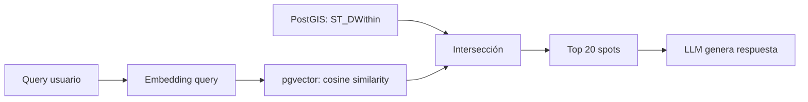

# Fase 4 — Vector Search
## Búsqueda por lenguaje natural con pgvector

---

## El Problema

```
"playa tranquila con sombra donde pueda ir con el perro sin que me molesten"
```

Esto NO es resoluble con SQL clásico:
- ❌ `WHERE playa = TRUE AND tranquilo = TRUE` → no existen esos campos
- ❌ Full-text search → busca palabras, no conceptos
- ❌ Gemini en tiempo real → lento y caro para filtrar 500K spots

**La solución: búsqueda vectorial.**

Cada spot se convierte en un vector numérico de 384-1536 dimensiones que captura su "esencia semántica". Buscar spots similares a una query = encontrar vectores cercanos.

---

## Arquitectura



**Flujo real:**
1. Usuario escribe query en lenguaje natural
2. Se genera embedding de la query (384 dims, ~5ms)
3. PostGIS filtra por radio geográfico → 2.000 candidatos
4. pgvector ordena por similitud coseno → Top 20
5. Gemini recibe los 20 spots con sus enrichments → respuesta

---

## Instalación de pgvector

```sql
CREATE EXTENSION IF NOT EXISTS vector;
```

En Docker, usar la imagen `pgvector/pgvector:pg16` o instalar:
```dockerfile
FROM postgres:16
RUN apt-get update && apt-get install -y postgresql-16-pgvector
```

---

## Tabla `spot_embeddings`

```sql
CREATE TABLE spot_embeddings (
    spot_id     INT PRIMARY KEY REFERENCES spots(id) ON DELETE CASCADE,
    embedding   vector(384),       -- all-MiniLM-L6-v2 (rápido, bueno)
    model       TEXT DEFAULT 'all-MiniLM-L6-v2',
    created_at  TIMESTAMPTZ DEFAULT NOW()
);

-- Índice HNSW para búsqueda aproximada eficiente
CREATE INDEX idx_embeddings_hnsw
    ON spot_embeddings USING hnsw (embedding vector_cosine_ops)
    WITH (m = 16, ef_construction = 64);
```

---

## Generación de Embeddings

### ¿Qué se embeddea?

NO el raw text de reviews. Se embeddea el **enrichment compacto**:

```python
def construir_texto_para_embedding(spot: dict, enrichment: dict) -> str:
    """Construye texto semánticamente rico para embedear."""
    partes = []

    # Nombre y tipo
    partes.append(f"{spot['canonical_name']} - {spot['tipo']}")

    # Ubicación
    if spot.get("region"):
        partes.append(f"Ubicado en {spot['region']}, {spot.get('country_iso', '')}")

    # Resumen LLM (la joya)
    if enrichment.get("llm_summary_es"):
        partes.append(enrichment["llm_summary_es"])
    elif enrichment.get("llm_summary_en"):
        partes.append(enrichment["llm_summary_en"])

    # Tags semánticos
    tags = enrichment.get("tags", [])
    if tags:
        partes.append(f"Tags: {', '.join(tags)}")

    # Best for
    best_for = enrichment.get("best_for", [])
    if best_for:
        partes.append(f"Ideal para: {', '.join(best_for)}")

    # Scores como texto (para que el embedding capture conceptos)
    scores_text = []
    if enrichment.get("quietness") and enrichment["quietness"] > 0.7:
        scores_text.append("lugar tranquilo")
    if enrichment.get("beauty") and enrichment["beauty"] > 0.7:
        scores_text.append("bonito con buenas vistas")
    if enrichment.get("stealth") and enrichment["stealth"] > 0.7:
        scores_text.append("bueno para pernocta discreta")
    if enrichment.get("police_risk") and enrichment["police_risk"] > 0.5:
        scores_text.append("riesgo de policía")
    if enrichment.get("sea_view"):
        scores_text.append("vistas al mar")
    if enrichment.get("mountain_view"):
        scores_text.append("vistas a montaña")
    if enrichment.get("beach_nearby"):
        scores_text.append("cerca de la playa")
    if enrichment.get("forest_nearby"):
        scores_text.append("en zona de bosque")
    if scores_text:
        partes.append(" · ".join(scores_text))

    # Servicios
    servicios = []
    if spot.get("agua_potable"): servicios.append("agua potable")
    if spot.get("electricidad"): servicios.append("electricidad")
    if spot.get("ducha"): servicios.append("ducha")
    if spot.get("wifi"): servicios.append("wifi")
    if spot.get("gratuito"): servicios.append("gratuito")
    if spot.get("perros"): servicios.append("se admiten perros")
    if servicios:
        partes.append(f"Servicios: {', '.join(servicios)}")

    return ". ".join(partes)
```

### Modelo de embeddings

| Modelo | Dims | Velocidad | Calidad | Coste |
|---|---|---|---|---|
| `all-MiniLM-L6-v2` | 384 | ★★★★★ | ★★★☆☆ | $0 (local) |
| `multilingual-e5-large` | 1024 | ★★★☆☆ | ★★★★★ | $0 (local) |
| `text-embedding-3-small` | 1536 | ★★★★☆ | ★★★★☆ | $0.02/1M tokens |

**Recomendación:** `all-MiniLM-L6-v2` para empezar (384 dims, corre en CPU del NAS). Migrar a multilingual-e5 cuando haya GPU.

### Pipeline batch

```python
from sentence_transformers import SentenceTransformer

model = SentenceTransformer("all-MiniLM-L6-v2")

async def generar_embeddings_batch(pool, batch_size=500):
    spots = await get_spots_con_enrichment_sin_embedding(pool, limit=batch_size)

    textos = [construir_texto_para_embedding(s["spot"], s["enrichment"]) for s in spots]
    embeddings = model.encode(textos, batch_size=64, show_progress_bar=True)

    async with pool.acquire() as conn:
        for spot, emb in zip(spots, embeddings):
            await conn.execute(
                "INSERT INTO spot_embeddings (spot_id, embedding) VALUES ($1, $2) "
                "ON CONFLICT (spot_id) DO UPDATE SET embedding = $2, created_at = NOW()",
                spot["spot"]["id"], emb.tolist()
            )
```

---

## Query Híbrida: Geo + Vector

```python
async def buscar_spots(conn, query: str, lat: float, lon: float,
                       radio_km: float = 50, limit: int = 20):
    """Búsqueda híbrida: geográfica + semántica."""

    # 1. Generar embedding de la query
    query_embedding = model.encode(query).tolist()

    # 2. Query híbrida
    rows = await conn.fetch("""
        SELECT
            s.id, s.canonical_name, s.tipo, s.lat, s.lon,
            s.gratuito, s.agua_potable, s.master_rating,
            e.quietness, e.safety, e.beauty, e.stealth,
            e.llm_summary_es, e.tags, e.best_for,
            1 - (se.embedding <=> $1::vector) AS similarity,
            ST_Distance(s.geog, ST_SetSRID(ST_MakePoint($3, $2), 4326)::geography) / 1000 AS dist_km
        FROM spots s
        JOIN spot_embeddings se ON se.spot_id = s.id
        LEFT JOIN spot_enrichments e ON e.spot_id = s.id
        WHERE s.activo = TRUE
          AND ST_DWithin(s.geog, ST_SetSRID(ST_MakePoint($3, $2), 4326)::geography, $4)
        ORDER BY similarity DESC
        LIMIT $5
    """, query_embedding, lat, lon, radio_km * 1000, limit)

    return [dict(r) for r in rows]
```

---

## Integración con el Chat

### Endpoint `/map-search` mejorado

```python
@app.get("/map-search")
async def map_search(q: str, lat: float, lon: float, radio: float = 50):
    async with pool.acquire() as conn:
        spots = await buscar_spots(conn, q, lat, lon, radio)

    # Construir contexto compacto para Gemini
    contexto = "\n".join([
        f"- {s['canonical_name']} ({s['tipo']}, {s['dist_km']:.1f}km): "
        f"{'🆓' if s['gratuito'] else '💳'} "
        f"quietness={s.get('quietness','?')} beauty={s.get('beauty','?')} "
        f"tags={s.get('tags',[])} — {s.get('llm_summary_es','Sin resumen')}"
        for s in spots[:10]
    ])

    respuesta = await gemini.generate(
        f"El usuario busca: '{q}'\n\nSpots cercanos:\n{contexto}\n\n"
        f"Recomienda los mejores spots para lo que busca. Sé conciso."
    )

    return {"spots": spots, "respuesta": respuesta}
```

---

## Rendimiento Esperado

| Operación | Latencia |
|---|---|
| Embedding de query | ~5ms (CPU) |
| Filtro PostGIS (50km) | ~15ms |
| pgvector top-20 de 2.000 candidatos | ~10ms |
| Total búsqueda | **~30ms** |
| + Gemini para respuesta | ~1.500ms |
| **Total usuario** | **< 2 segundos** |

---

## Métricas de Éxito

| Métrica | Objetivo |
|---|---|
| Spots con embedding | ≥ 90% de los enriched |
| Latencia búsqueda vectorial | < 50ms |
| Relevancia top-5 | > 80% (validación manual) |
| Queries/segundo soportadas | > 10 concurrentes |
