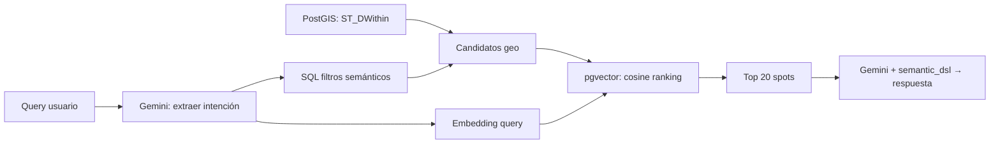

# Fase 4 — Vector Search + Búsqueda Semántica Híbrida
## Búsqueda por lenguaje natural sobre el estado de creencia geotemporal

> **Prerrequisito**: Fase 3 completada — `spot_semantic_state` poblado con señales, `semantic_dsl` generado, resúmenes `summary_es/en` disponibles.

---

## El Problema

```
"playa tranquila con sombra donde pueda ir con el perro sin que me molesten"
```

Esto NO es resoluble con SQL clásico:
- ❌ `WHERE playa = TRUE AND tranquilo = TRUE` → campos fijos no capturan conceptos
- ❌ Full-text search → busca palabras, no intención semántica
- ❌ Gemini en tiempo real sobre 723K spots → lento y carísimo

**Con Phase 3 tenemos ventajas que antes no existían:**
- ✅ `spot_semantic_state` con señales materializadas (`quietness_score`, `overnight_safe`, etc.)
- ✅ `semantic_dsl` compacto por spot ("quiet:+0.8 police:-0.2 beauty:+0.9 shade_am:T")
- ✅ Resúmenes LLM pre-generados en `summary_es`/`summary_en`

**La solución: búsqueda en 3 capas.**

```
Query → [Capa 1: PostGIS geo-filter]
       → [Capa 2: SQL semántico sobre señales materializadas]
       → [Capa 3: pgvector similitud coseno para ranking fino]
       → Top 20 → Gemini con semantic_dsl → respuesta
```

---

## Arquitectura



### Flujo detallado

1. **Usuario escribe** query en lenguaje natural
2. **Gemini Flash (intent extraction)**: Extrae filtros estructurados + query semántica
   - Input: "playa tranquila con sombra donde pueda ir con el perro sin que me molesten"
   - Output: `{filters: {quietness_min: 0.7, overnight_safe: true}, semantic_query: "quiet beach with shade, dog friendly, discreet overnight"}`
3. **PostGIS** filtra por radio geográfico → ~5.000 candidatos
4. **SQL semántico** aplica filtros sobre columnas materializadas de `spot_semantic_state` → ~500 candidatos
5. **pgvector** ordena por similitud coseno → Top 20
6. **Gemini** recibe los 20 spots con su `semantic_dsl` compacto → respuesta natural

**Ventaja clave vs. plan anterior**: La Capa 2 (SQL semántico) reduce candidatos 10x antes de llegar a pgvector. Esto es posible gracias a las columnas materializadas de Phase 3.

---

## Tabla `spot_embeddings` (ya existe en schema.sql)

La tabla ya está definida en [schema.sql L323-332](file:///c:/geospots/db/schema.sql#L323-L332):

```sql
CREATE TABLE IF NOT EXISTS spot_embeddings (
    spot_id         INT PRIMARY KEY REFERENCES spots(id) ON DELETE CASCADE,
    embedding       vector(384),
    texto_fuente    TEXT,              -- Texto que se embeddeó (para debug/regeneración)
    model           TEXT DEFAULT 'all-MiniLM-L6-v2',
    created_at      TIMESTAMPTZ DEFAULT NOW()
);

CREATE INDEX IF NOT EXISTS idx_embeddings_hnsw ON spot_embeddings
    USING hnsw (embedding vector_cosine_ops) WITH (m = 16, ef_construction = 64);
```

### Cambio necesario: soporte para modelos de mayor dimensión

```sql
-- Si se migra a text-embedding-004 (768 dims) o multilingual-e5-large (1024 dims)
-- hay que recrear la columna y el índice:
ALTER TABLE spot_embeddings ALTER COLUMN embedding TYPE vector(768);
DROP INDEX IF EXISTS idx_embeddings_hnsw;
CREATE INDEX idx_embeddings_hnsw ON spot_embeddings
    USING hnsw (embedding vector_cosine_ops) WITH (m = 16, ef_construction = 64);
```

---

## Generación de Embeddings

### ¿Qué se embeddea?

NO el raw text de reviews. Se embeddea una **representación compuesta** del estado semántico del spot generada a partir de `spot_semantic_state` + `spots`:

```python
def construir_texto_para_embedding(spot: dict, state: dict) -> str:
    """
    Construye texto semánticamente rico para embedear.
    Fuente: spots + spot_semantic_state (Phase 3).
    """
    partes = []

    # 1. Identidad del spot
    partes.append(f"{spot['canonical_name']} - {spot['tipo']}")
    if spot.get("region"):
        partes.append(f"en {spot['region']}, {spot.get('country_iso', '').upper()}")

    # 2. Resumen LLM pre-generado (la pieza más valiosa semánticamente)
    if state.get("summary_es"):
        partes.append(state["summary_es"])
    elif state.get("summary_en"):
        partes.append(state["summary_en"])

    # 3. Tags y categorías inferidas por el pipeline
    if state.get("tags"):
        partes.append(f"Tags: {', '.join(state['tags'])}")
    if state.get("best_for"):
        partes.append(f"Ideal para: {', '.join(state['best_for'])}")
    if state.get("best_season"):
        partes.append(f"Mejor época: {state['best_season']}")

    # 4. Señales semánticas convertidas a texto natural
    #    Esto es CLAVE: el embedding captura conceptos, no números
    signal_text = []
    qs = state.get("quietness_score")
    if qs is not None:
        if qs > 0.7: signal_text.append("lugar muy tranquilo y silencioso")
        elif qs < 0.3: signal_text.append("ruidoso, cerca de carretera o zona urbana")

    bs = state.get("beauty_score")
    if bs is not None:
        if bs > 0.7: signal_text.append("entorno bonito con buenas vistas")
        elif bs < 0.3: signal_text.append("entorno poco atractivo")

    ss = state.get("safety_score")
    if ss is not None:
        if ss > 0.7: signal_text.append("zona segura")
        elif ss < 0.3: signal_text.append("zona con problemas de seguridad")

    ps = state.get("police_risk_score")
    if ps is not None:
        if ps > 0.5: signal_text.append("riesgo de control policial o multa")
        elif ps < 0.2: signal_text.append("sin problemas con policía")

    if state.get("overnight_safe") is True:
        signal_text.append("se puede pernoctar")
    elif state.get("overnight_safe") is False:
        signal_text.append("pernocta prohibida o arriesgada")

    sts = state.get("stealth_score")
    if sts is not None and sts > 0.7:
        signal_text.append("discreto, bueno para pernocta libre")

    cs = state.get("crowd_level_score")
    if cs is not None:
        if cs > 0.7: signal_text.append("muy masificado")
        elif cs < 0.3: signal_text.append("poco frecuentado, solitario")

    # Señales de JSONB (signals_data)
    sd = state.get("signals_data", {})
    if sd.get("sea_view", {}).get("score") == 1:
        signal_text.append("vistas al mar")
    if sd.get("mountain_view", {}).get("score") == 1:
        signal_text.append("vistas a montaña")
    if sd.get("lake_nearby", {}).get("score") == 1:
        signal_text.append("cerca de un lago")
    if sd.get("shade_morning", {}).get("score") == 1:
        signal_text.append("sombra por la mañana")
    if sd.get("shade_afternoon", {}).get("score") == 1:
        signal_text.append("sombra por la tarde")
    if sd.get("wind_exposure", {}).get("score", 0) > 0.7:
        signal_text.append("expuesto al viento")
    rq = sd.get("road_quality", {}).get("score")
    if rq is not None and rq < 0.3:
        signal_text.append("acceso difícil, pista o camino en mal estado")
    lv = sd.get("large_vehicle", {}).get("score")
    if lv is not None and lv < 0.3:
        signal_text.append("no apto para vehículos grandes")

    if signal_text:
        partes.append(". ".join(signal_text))

    # 5. Servicios (de la tabla spots)
    servicios = []
    if spot.get("agua_potable"): servicios.append("agua potable")
    if spot.get("electricidad"): servicios.append("electricidad")
    if spot.get("ducha"): servicios.append("ducha")
    if spot.get("wifi"): servicios.append("wifi")
    if spot.get("gratuito"): servicios.append("gratuito")
    if spot.get("perros"): servicios.append("admite perros")
    if spot.get("vaciado_negras"): servicios.append("vaciado de aguas negras")
    if servicios:
        partes.append(f"Servicios: {', '.join(servicios)}")

    return ". ".join(partes)
```

### Modelo de embeddings

| Modelo | Dims | Multiidioma | Velocidad | Calidad | Coste | Requiere |
|---|---|---|---|---|---|---|
| `text-embedding-004` (Google) | 768 | ✅ Excelente | ★★★★☆ | ★★★★★ | $0.006/1M tokens | `GEMINI_API_KEY` (ya existe) |
| `all-MiniLM-L6-v2` | 384 | ❌ Solo inglés | ★★★★★ | ★★★☆☆ | $0 (local CPU) | `sentence-transformers` |
| `multilingual-e5-large` | 1024 | ✅ Bueno | ★★☆☆☆ | ★★★★☆ | $0 (local, necesita GPU) | GPU ≥6GB |

**Decisión: `text-embedding-004` (Google)**

Razones:
1. **Multiidioma nativo**: Reviews en ES/FR/DE/EN/IT/NL/PT. MiniLM solo entiende inglés.
2. **Ya tenemos la API key**: `GEMINI_API_KEY` en `.env` sirve para embeddings también.
3. **Coste ridículo**: 723K spots × ~100 tokens/spot = 72M tokens × $0.006/1M = **$0.43 total**.
4. **Sin dependencia de GPU**: No necesita `sentence-transformers` ni PyTorch (~2GB de instalación).
5. **Calidad superior**: 768 dims con entrenamiento state-of-the-art de Google.

**Fallback**: Si se quiere 100% offline, usar `all-MiniLM-L6-v2` con textos pre-traducidos a inglés.

### Pipeline de generación batch

```python
import google.genai as genai
import asyncio

# Configurar cliente
client = genai.Client(api_key=os.environ["GEMINI_API_KEY"])

async def generar_embeddings_batch(pool, batch_size=100):
    """
    Genera embeddings para spots con spot_semantic_state pero sin embedding.
    Usa text-embedding-004 de Google.
    """
    async with pool.acquire() as conn:
        spots = await conn.fetch("""
            SELECT s.id, s.canonical_name, s.tipo, s.region, s.country_iso,
                   s.gratuito, s.agua_potable, s.electricidad, s.ducha,
                   s.wifi, s.perros, s.vaciado_negras,
                   sss.quietness_score, sss.safety_score, sss.police_risk_score,
                   sss.beauty_score, sss.crowd_level_score, sss.overnight_safe,
                   sss.stealth_score, sss.signals_data,
                   sss.summary_es, sss.summary_en, sss.tags, sss.best_for,
                   sss.best_season, sss.semantic_dsl
            FROM spots s
            JOIN spot_semantic_state sss ON sss.spot_id = s.id
            LEFT JOIN spot_embeddings se ON se.spot_id = s.id
            WHERE s.activo = TRUE
              AND sss.total_observations > 0
              AND se.spot_id IS NULL  -- Solo spots sin embedding
            ORDER BY s.total_reviews DESC  -- HOT spots primero
            LIMIT $1
        """, batch_size)

    if not spots:
        return {"processed": 0}

    # Construir textos
    textos = []
    for s in spots:
        texto = construir_texto_para_embedding(dict(s), dict(s))
        textos.append(texto)

    # Embeddings en batch (Google API acepta hasta 2048 textos por request)
    result = client.models.embed_content(
        model="models/text-embedding-004",
        contents=textos
    )

    # Guardar en DB
    async with pool.acquire() as conn:
        async with conn.transaction():
            for spot, emb, texto in zip(spots, result.embeddings, textos):
                await conn.execute("""
                    INSERT INTO spot_embeddings (spot_id, embedding, texto_fuente, model)
                    VALUES ($1, $2, $3, 'text-embedding-004')
                    ON CONFLICT (spot_id) DO UPDATE SET
                        embedding = $2, texto_fuente = $3, created_at = NOW()
                """, spot['id'], emb.values, texto)

    return {"processed": len(spots)}
```

### Regeneración por cambio semántico

Los embeddings se regeneran cuando Phase 3 detecta un `semantic_shift` (distancia Manhattan > 0.15):

```python
async def regenerar_embeddings_stale(pool, batch_size=100):
    """Regenera embeddings de spots cuyo estado semántico cambió."""
    async with pool.acquire() as conn:
        stale = await conn.fetch("""
            SELECT se.spot_id
            FROM spot_embeddings se
            JOIN spot_semantic_state sss ON sss.spot_id = se.spot_id
            WHERE sss.updated_at > se.created_at  -- Estado más reciente que embedding
            LIMIT $1
        """, batch_size)

    if stale:
        # Borrar embeddings stale → el batch normal los regenera
        async with pool.acquire() as conn:
            await conn.execute("""
                DELETE FROM spot_embeddings WHERE spot_id = ANY($1)
            """, [r['spot_id'] for r in stale])

        return await generar_embeddings_batch(pool, batch_size)

    return {"processed": 0}
```

---

## Coste de Embeddings

| Operación | Volumen | Tokens | Coste |
|---|---|---|---|
| **Batch inicial** (todos los spots con state) | ~300K spots | 30M tokens | **$0.18** |
| **Query embedding** (por búsqueda de usuario) | 1 query | ~20 tokens | $0.00000012 |
| **Regeneración mensual** (spots con semantic shift) | ~5K spots | 500K tokens | **$0.003** |
| **Total primer año** | | | **~$0.25** |

Coste despreciable. No merece la pena optimizar.

---

## Query Híbrida: Geo + Semántico + Vector

### Paso 1: Extracción de intención con Gemini

```python
INTENT_PROMPT = """Analiza esta búsqueda de un usuario que busca spots para pernoctar con autocaravana.
Extrae filtros SQL y una query semántica para búsqueda vectorial.

FILTROS DISPONIBLES (columnas materializadas en spot_semantic_state):
- quietness_score: REAL 0-1 (0=ruidoso, 1=silencio)
- safety_score: REAL 0-1
- police_risk_score: REAL 0-1 (0=sin riesgo, 1=seguro multa)
- beauty_score: REAL 0-1
- crowd_level_score: REAL 0-1 (0=vacío, 1=lleno)
- overnight_safe: BOOLEAN
- stealth_score: REAL 0-1

FILTROS DE spots:
- gratuito: BOOLEAN
- agua_potable, electricidad, ducha, wifi, perros: BOOLEAN
- tipo: 'area_ac', 'camping', 'parking_publico', 'wild', 'naturaleza', etc.

QUERY DEL USUARIO: "{query}"

Responde SOLO JSON:
{
  "sql_filters": {"quietness_score_min": 0.7, "overnight_safe": true},
  "semantic_query": "quiet beach with shade, dog friendly",
  "explanation": "busca playa tranquila con sombra y perro"
}"""

async def extraer_intencion(query: str) -> dict:
    response = await client.aio.models.generate_content(
        model="gemini-2.0-flash",
        contents=INTENT_PROMPT.format(query=query)
    )
    return json.loads(response.text)
```

### Paso 2: Query SQL híbrida

```python
async def buscar_spots(conn, query: str, lat: float, lon: float,
                       radio_km: float = 50, limit: int = 20):
    """Búsqueda en 3 capas: Geo → Semántico SQL → Vector ranking."""

    # 1. Extraer intención
    intent = await extraer_intencion(query)
    filters = intent.get("sql_filters", {})
    semantic_query = intent.get("semantic_query", query)

    # 2. Embedding de la query semántica
    emb_result = client.models.embed_content(
        model="models/text-embedding-004",
        contents=[semantic_query]
    )
    query_embedding = emb_result.embeddings[0].values

    # 3. Construir filtros SQL dinámicos sobre spot_semantic_state
    where_parts = [
        "s.activo = TRUE",
        "ST_DWithin(s.geog, ST_SetSRID(ST_MakePoint($3, $2), 4326)::geography, $4)"
    ]
    params = [query_embedding, lat, lon, radio_km * 1000]
    idx = 5

    FILTER_MAP = {
        "quietness_score_min": ("sss.quietness_score >= ${}", float),
        "quietness_score_max": ("sss.quietness_score <= ${}", float),
        "safety_score_min": ("sss.safety_score >= ${}", float),
        "police_risk_score_max": ("sss.police_risk_score <= ${}", float),
        "beauty_score_min": ("sss.beauty_score >= ${}", float),
        "crowd_level_score_max": ("sss.crowd_level_score <= ${}", float),
        "overnight_safe": ("sss.overnight_safe = ${}", bool),
        "stealth_score_min": ("sss.stealth_score >= ${}", float),
        "gratuito": ("s.gratuito = ${}", bool),
        "agua_potable": ("s.agua_potable = ${}", bool),
        "electricidad": ("s.electricidad = ${}", bool),
        "perros": ("s.perros = ${}", bool),
        "tipo": ("s.tipo = ${}", str),
    }

    for key, (template, cast) in FILTER_MAP.items():
        if key in filters and filters[key] is not None:
            where_parts.append(template.format(idx))
            params.append(cast(filters[key]))
            idx += 1

    params.append(limit)
    where_clause = " AND ".join(where_parts)

    # 4. Query híbrida: geo + filtros semánticos + vector ranking
    rows = await conn.fetch(f"""
        SELECT
            s.id, s.canonical_name, s.tipo, s.lat, s.lon,
            s.gratuito, s.agua_potable, s.master_rating, s.total_reviews,
            sss.quietness_score, sss.safety_score, sss.beauty_score,
            sss.police_risk_score, sss.stealth_score, sss.crowd_level_score,
            sss.overnight_safe, sss.semantic_dsl,
            sss.summary_es, sss.tags, sss.best_for,
            1 - (se.embedding <=> $1::vector) AS similarity,
            ST_Distance(s.geog, ST_SetSRID(ST_MakePoint($3, $2), 4326)::geography) / 1000 AS dist_km
        FROM spots s
        JOIN spot_embeddings se ON se.spot_id = s.id
        JOIN spot_semantic_state sss ON sss.spot_id = s.id
        WHERE {where_clause}
        ORDER BY similarity DESC
        LIMIT ${idx}
    """, *params)

    return [dict(r) for r in rows]
```

---

## Integración con la API

### Nuevo endpoint `/search/semantic`

```python
@app.get("/search/semantic")
async def semantic_search(
    q: str = Query(..., description="Query en lenguaje natural"),
    lat: float = Query(...), lon: float = Query(...),
    radio_km: float = Query(50, le=500),
    limit: int = Query(20, le=50),
    with_response: bool = Query(True, description="Incluir respuesta LLM"),
):
    """Búsqueda semántica híbrida: geo + filtros + vector + LLM."""
    async with pool.acquire() as conn:
        spots = await buscar_spots(conn, q, lat, lon, radio_km, limit)

    result = {"spots": spots, "total": len(spots)}

    if with_response and spots:
        # Usar semantic_dsl compacto (ahorra ~75% tokens vs texto completo)
        contexto = "\n".join([
            f"#{i+1} {s['canonical_name']} ({s['tipo']}, {s['dist_km']:.1f}km, "
            f"sim={s['similarity']:.2f}): {s.get('semantic_dsl', 'N/A')}"
            for i, s in enumerate(spots[:10])
        ])

        response = await client.aio.models.generate_content(
            model="gemini-2.0-flash",
            contents=(
                f"El usuario busca: \"{q}\"\n\n"
                f"Top spots encontrados (DSL semántico):\n{contexto}\n\n"
                f"Recomienda los mejores. Sé conciso y directo. "
                f"Usa el nombre del spot y la distancia."
            )
        )
        result["response"] = response.text

    return result
```

**Ahorro de tokens con `semantic_dsl`:**
- Sin DSL: ~200 tokens/spot × 10 spots = 2.000 tokens de contexto
- Con DSL: ~30 tokens/spot × 10 spots = 300 tokens de contexto
- **Ahorro: 85% en tokens de contexto por query**

### Migración del endpoint existente `/search`

El [endpoint actual](file:///c:/geospots/api/main.py#L121-L175) sigue funcionando con SQL clásico. No se rompe. `/search/semantic` es un endpoint **nuevo** que lo complementa.

```python
# api/main.py — Añadir al final, antes del mount de PWA
# El endpoint existente /search sigue funcionando para filtros simples
# /search/semantic es el nuevo para lenguaje natural
```

---

## Estructura de Archivos

```
c:\geospots\
├── enrichment/
│   └── embedding_generator.py   # ← NUEVO: generar_embeddings_batch(), regenerar_stale()
├── api/
│   └── main.py                  # MODIFICAR: añadir /search/semantic
└── jobs/
    └── nightly_embeddings.py    # ← NUEVO: cron para regenerar embeddings stale
```

### `enrichment/embedding_generator.py`

Contiene:
- `construir_texto_para_embedding()` — Genera texto semántico desde spot + state
- `generar_embeddings_batch()` — Batch de nuevos embeddings (Google API)
- `regenerar_embeddings_stale()` — Regenera los que cambiaron tras Phase 3 shifts

### `jobs/nightly_embeddings.py`

```python
"""Cron nocturno: regenera embeddings de spots con semantic shift."""
import asyncio

async def main():
    pool = await create_pool()

    # 1. Regenerar embeddings stale (estado semántico cambió)
    result = await regenerar_embeddings_stale(pool, batch_size=500)
    logger.info(f"Embeddings regenerados: {result['processed']}")

    # 2. Generar embeddings nuevos (spots recién procesados por Phase 3)
    result = await generar_embeddings_batch(pool, batch_size=1000)
    logger.info(f"Embeddings nuevos: {result['processed']}")

    await pool.close()

if __name__ == "__main__":
    asyncio.run(main())
```

---

## Rendimiento Esperado

| Operación | Latencia |
|---|---|
| Gemini intent extraction | ~300ms |
| Embedding de query (Google API) | ~50ms |
| PostGIS geo-filter (50km, 723K spots) | ~15ms |
| SQL filtros semánticos (sobre columnas indexadas) | ~5ms |
| pgvector top-20 de ~500 candidatos pre-filtrados | ~3ms |
| **Total búsqueda** | **~370ms** |
| + Gemini respuesta con DSL | ~800ms |
| **Total usuario** | **~1.2 segundos** |

vs. plan anterior sin filtro semántico SQL:
- pgvector tenía que rankear 5.000 candidatos en vez de 500 → más lento y menos preciso
- Sin intent extraction: no podía traducir "sin que me molesten" → `stealth_score >= 0.7`

---

## Dependencias

```
# Añadir a requirements (solo Google SDK, ya listado en Phase 3)
google-genai>=1.0.0    # Embeddings + Gemini Flash (misma API key)
```

**No se necesita**:
- ❌ `sentence-transformers` (2GB de instalación con PyTorch)
- ❌ `torch` / `transformers`
- ❌ GPU para embeddings

Todo funciona con la API de Google y la `GEMINI_API_KEY` ya configurada.

---

## Métricas de Éxito

| Métrica | Objetivo |
|---|---|
| Spots con embedding | ≥ 80% de los spots con `spot_semantic_state` |
| Latencia búsqueda completa | < 1.5s (incluye Gemini response) |
| Relevancia top-5 | > 85% (validación manual de 50 queries) |
| Queries/segundo | > 20 concurrentes |
| Coste mensual embeddings | < $0.05 |

---

## Orden de Implementación

1. **Verificar** que `spot_semantic_state` tiene datos (Phase 3 batch completado)
2. **Crear** `enrichment/embedding_generator.py` con `construir_texto_para_embedding()`
3. **Migrar** tabla `spot_embeddings` a `vector(768)` si se usa `text-embedding-004`
4. **Correr** batch inicial de embeddings (~$0.18, <5 minutos)
5. **Crear** endpoint `/search/semantic` en `api/main.py`
6. **Testear** con 20 queries manuales en español, francés, alemán, inglés
7. **Crear** `jobs/nightly_embeddings.py` para regeneración automática
8. **Validar** métricas de relevancia
