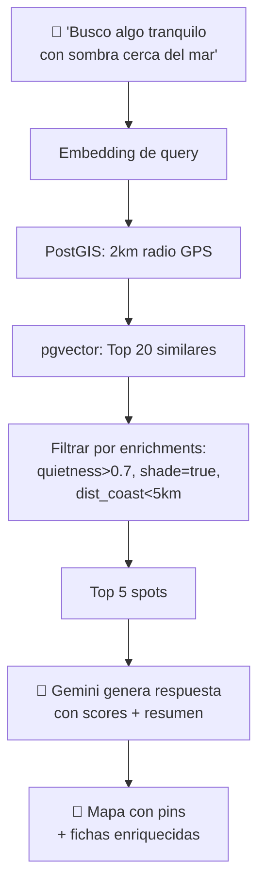
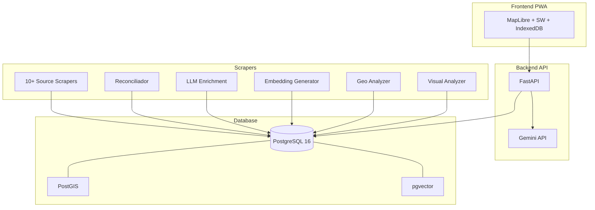

# Fase 7 — The Product
## PWA 2.0: El Google Maps camper que no existe

---

## La Visión del Producto

Nadie quiere abrir 7 apps. Nadie quiere buscar en 7 mapas. Nadie quiere comparar 7 bases de datos.

CamperBot se convierte en **la única app que necesitas** porque:
- Tiene TODOS los spots de TODAS las fuentes
- Sabe más de cada spot que la propia fuente original
- Responde preguntas que NINGUNA app individual puede responder
- Funciona offline en medio de la nada

---

## Flujo de Usuario Final



---

## Componentes de la PWA 2.0

### 1. Mapa Inteligente

```
┌──────────────────────────────────┐
│  🔍 Buscar o hablar...      🎤  │
├──────────────────────────────────┤
│                                  │
│         [MAPA MapLibre]          │
│                                  │
│    🟢 gratuito                   │
│    🔵 área AC                    │
│    🟠 camping                    │
│    ⚪ parking                    │
│                                  │
│  ┌──────────────────────────┐    │
│  │ 📍 Vista al Mar          │    │
│  │ ★★★★☆ 4.2 · 🆓 · 💧   │    │
│  │ 😌 0.9 · 🛡️ 0.7 · 🌅   │    │
│  │ ⛺🔷🏕️ 3 fuentes        │    │
│  └──────────────────────────┘    │
│                                  │
├──────────────────────────────────┤
│ 🏕️ Todo  🆓 Gratis  💧 Agua    │
│ 😌 Tranq  🌊 Mar  🌲 Bosque    │
└──────────────────────────────────┘
```

**Diferencias clave vs actual:**
- Chips de filtro semántico (tranquilo, mar, bosque) además de los clásicos
- Mini-scores de enrichment visibles en el popup (😌 quietness, 🛡️ safety)
- Indicador de confianza (cuántas fuentes, cuántas reviews)

### 2. Ficha de Spot Enriquecida

```
┌──────────────────────────────────┐
│ 📍 ÁREA AC                       │
│ Playa de las Catedrales          │
│ ★★★★☆ 4.3 (142 reviews)        │
│                                  │
│ 🏕️ P4N · 🔷 CC · ⛺ iOv · 🚐 F│
├──────────────────────────────────┤
│ 📸 [foto1] [foto2] [foto3]      │
├──────────────────────────────────┤
│ ── SCORES IA ──                  │
│ 😌 Tranquilidad    ████████░░ 82│
│ 🛡️ Seguridad       ██████░░░░ 61│
│ 🌅 Belleza          █████████░ 95│
│ 🥷 Stealth          ███░░░░░░░ 33│
│ 🔇 Silencio         ███████░░░ 71│
│                                  │
│ ── ENTORNO GEO ──                │
│ 🏖️ Costa: 200m · 🌲 Bosque: 1km│
│ ☀️ Sol mañana: 5h · ⛰️ Alt: 45m│
│ 📶 Cobertura: buena              │
│ 🅿️ Acceso: asfalto              │
│                                  │
│ ── SERVICIOS ──                  │
│ 🆓 Gratuito · 💧 Agua · 🚽 WC  │
│ ⚡ Electricidad · 🐕 Perros OK  │
│                                  │
│ ── RESUMEN IA ──                 │
│ "Área amplia frente a la playa   │
│ de las Catedrales. Muy turístico │
│ en verano (julio-agosto lleno).  │
│ Fuera de temporada perfecto.     │
│ Policía pasa pero no multa si    │
│ te vas por la mañana."           │
│                                  │
│ ── REVIEWS RECIENTES ──          │
│ [CamperContact, mayo 2026]       │
│ ★★★★★ "Reformaron los baños..." │
│ [P4N, marzo 2026]                │
│ ★★★★☆ "Tranquilo fuera de..."   │
│                                  │
│ ⚠️ CONFLICTO: P4N dice gratis,  │
│ CC indica €5 en temporada alta   │
│                                  │
├──────────────────────────────────┤
│ 💬 Preguntar  🗺️ Navegar  ❤️   │
└──────────────────────────────────┘
```

### 3. Búsqueda por Voz / Natural

**Antes:**
```
Usuario: "camping gratis"
→ SQL: WHERE gratuito = TRUE AND tipo = 'camping'
```

**Después:**
```
Usuario: "sitio bonito para dormir esta noche, que no sea muy visible
          y tenga sombra, si puede ser cerca del mar"
→ Embedding → pgvector → PostGIS → Enrichment filter → Top 5
→ Gemini: "Te recomiendo estos 3 spots..."
```

### 4. Modo Offline Completo

Para funcionar sin cobertura en medio de la nada:

```
┌─────────────────────────────────┐
│        DESCARGAR ZONA           │
│                                 │
│  📍 Mi posición actual          │
│  📏 Radio: [25km] [50km] [100km]│
│                                 │
│  Incluir:                       │
│  ☑ Tiles de mapa (12 MB)       │
│  ☑ Spots + enrichments (2 MB)  │
│  ☐ Fotos thumbnails (45 MB)    │
│  ☐ Reviews completas (8 MB)    │
│                                 │
│  Total estimado: 14 MB          │
│                                 │
│  [DESCARGAR ZONA]               │
└─────────────────────────────────┘
```

**Implementación:**
- **Tiles:** PMTiles + protomaps (tiles vectoriales en un solo archivo)
- **Datos:** IndexedDB con spots pre-filtrados por bbox
- **Búsqueda offline:** embeddings pre-descargados + búsqueda local con WASM

### 5. Filtros Inteligentes por Mood

Más allá de "gratuito / agua / vaciado":

```
┌─────────────────────────────────┐
│ ¿Qué buscas hoy?               │
│                                 │
│ 😌 Tranquilidad    🌊 Playa    │
│ 🏔️ Montaña        🌲 Bosque    │
│ 🥷 Discreto        🌅 Vistas    │
│ 👨‍👩‍👧 Familias       🐕 Perros    │
│ 🏄 Surf            📸 Fotogénico│
│ 🆓 Gratis          ⚡ Servicios │
│                                 │
│ Seleccionados: 😌 🌊 🐕        │
│ 47 spots encontrados            │
└─────────────────────────────────┘
```

Cada chip mapea a un filtro sobre `spot_enrichments`:
- 😌 Tranquilidad → `quietness > 0.7`
- 🥷 Discreto → `stealth > 0.6`
- 🌊 Playa → `beach_nearby = true OR dist_coast_km < 2`
- 📸 Fotogénico → `beauty > 0.8`

### 6. Sistema de Favoritos y Rutas

```sql
CREATE TABLE user_favorites (
    id          SERIAL PRIMARY KEY,
    user_id     TEXT NOT NULL,  -- anónimo, hash del dispositivo
    spot_id     INT REFERENCES spots(id),
    notes       TEXT,
    visited     BOOLEAN DEFAULT FALSE,
    visit_date  DATE,
    created_at  TIMESTAMPTZ DEFAULT NOW()
);

CREATE TABLE user_routes (
    id          SERIAL PRIMARY KEY,
    user_id     TEXT NOT NULL,
    name        TEXT,
    spots       INT[],  -- Array ordenado de spot_ids
    total_km    REAL,
    created_at  TIMESTAMPTZ DEFAULT NOW()
);
```

---

## Arquitectura Técnica Final



---

## Monetización (Opcional, Futuro)

### Modelo Freemium

| Tier | Funcionalidad | Precio |
|---|---|---|
| **Free** | Mapa + búsqueda + 5 spots/día detalle | $0 |
| **Pro** | Búsqueda ilimitada + offline + voz + rutas | €2.99/mes |
| **Pro+** | API access + export GPX + alertas proximidad | €6.99/mes |

### B2B / API

| Producto | Cliente | Precio |
|---|---|---|
| API de spots enriquecidos | Apps de navegación, alquiler campers | €0.01/query |
| Dataset bulk (actualización mensual) | Agregadores, investigadores | €500/mes |
| White-label map widget | Webs de turismo, booking | €200/mes |

### El Argumento de Venta

> "Park4Night tiene los spots. CamperContact tiene los precios.
> Furgovw tiene la comunidad española. iOverlander tiene el offgrid.
>
> **Nosotros tenemos TODO fusionado, enriquecido con IA,
> y buscable por voz en un solo mapa.**
>
> Somos el Google Maps del camper."

---

## Métricas de Éxito del Producto

| Métrica | Objetivo (6 meses post-lanzamiento) |
|---|---|
| Spots en DB | > 500.000 |
| Spots enriched | > 200.000 |
| Spots con geo analysis | > 400.000 |
| Latencia búsqueda natural | < 2 segundos |
| Modo offline funcional | Sí (tiles + datos) |
| Fuentes integradas | ≥ 10 |
| PWA instalable | Sí (iOS + Android + Desktop) |
| Tamaño PWA offline (50km) | < 20 MB |

---

## Lo que hace ÚNICO a este proyecto

1. **Nadie más fusiona 10+ fuentes** en un solo spot canónico
2. **Nadie más pre-computa scores semánticos** con LLM sobre cientos de miles de reviews
3. **Nadie más tiene búsqueda vectorial geoespacial** para queries naturales
4. **Nadie más combina datos de terreno DEM** con reviews de usuarios
5. **Nadie más tiene stealth scoring** basado en datos reales

Esto no es "otra app de camping".  
Esto es un **motor de inteligencia geoespacial**.

Y como bien dijo el otro LLM: luego esto sirve para **setas, pesca, trekking, surf, fotografía, astronomía**... cualquier actividad que necesite encontrar EL lugar perfecto.
